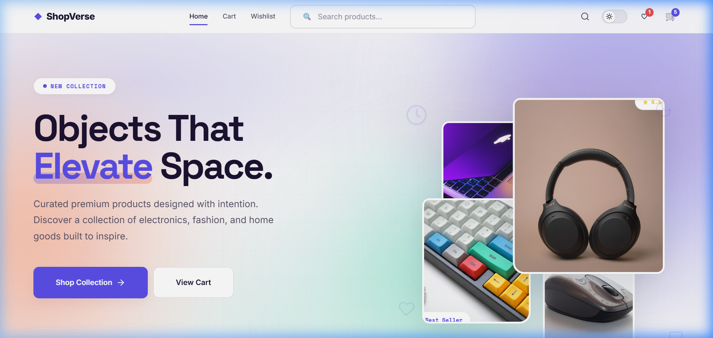
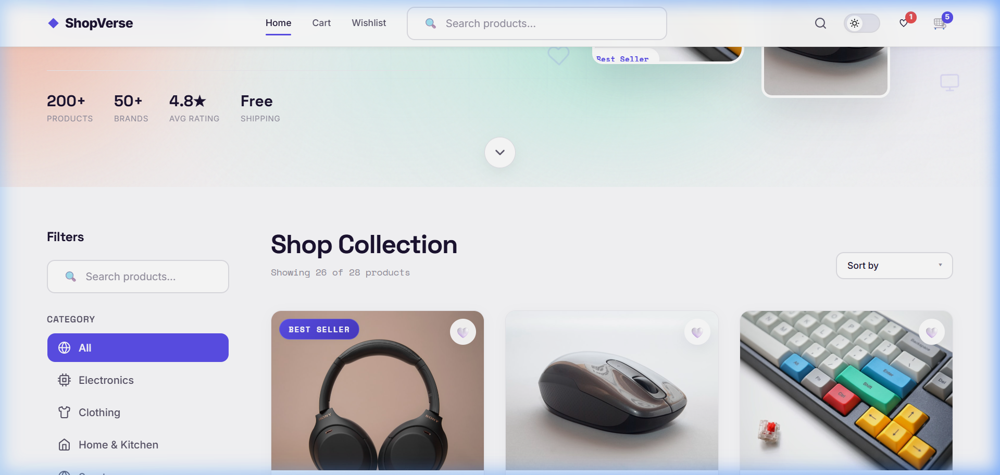
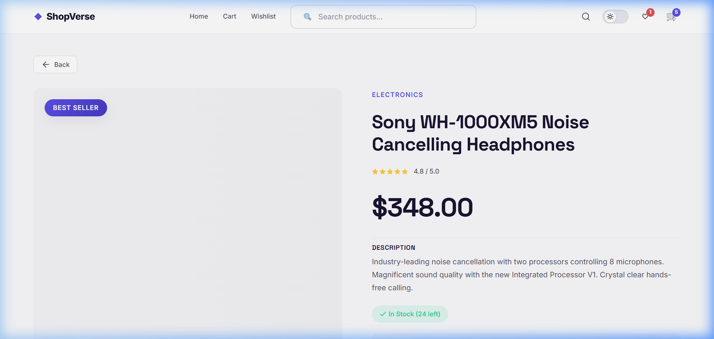
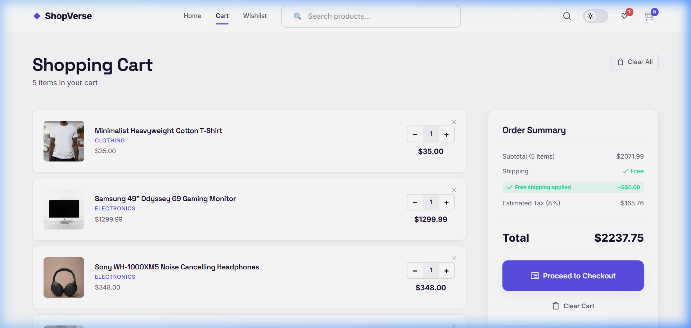
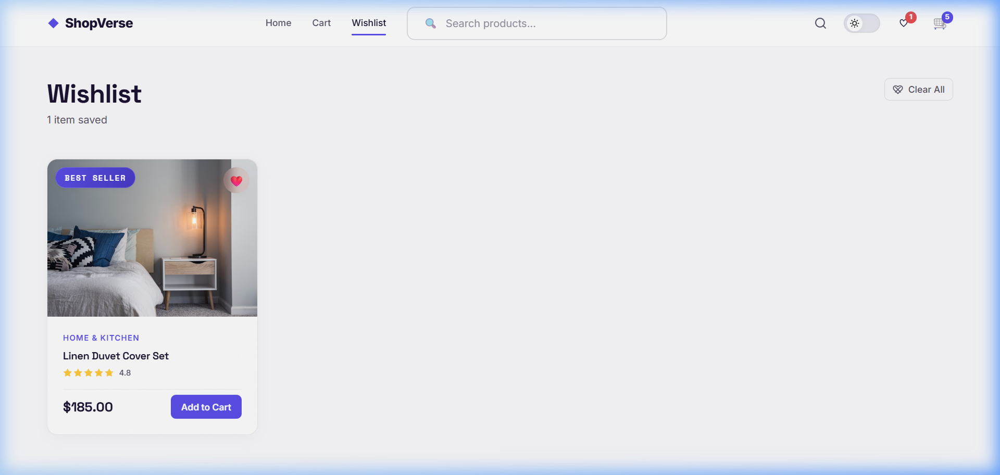
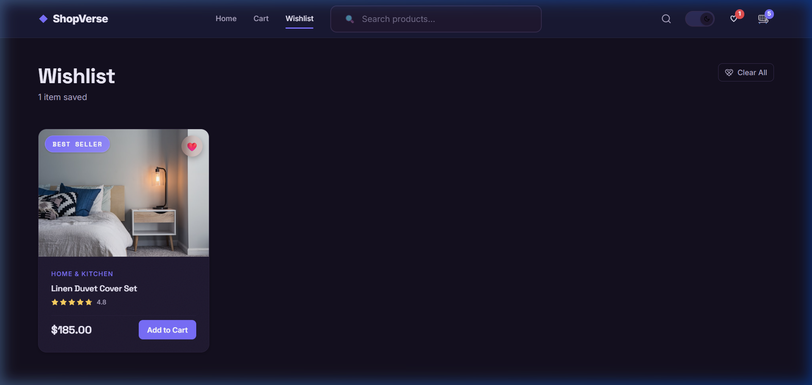

# 🛍️ ShopVerse

> A modern, full-featured e-commerce frontend built with **React 19** and **Vite**. Featuring smooth page transitions, persistent cart & wishlist, dark mode, advanced filtering, and a premium glassmorphic UI.

---

## 📸 Screenshots

### 🏠 Homepage — Hero (Light Mode)


### 🗂️ Product Grid with Filters


### 🔍 Product Details Page


### 🛒 Shopping Cart


### ❤️ Wishlist


### 🌙 Dark Mode


---

## 🚀 Features

| Feature | Description |
|---|---|
| 🛒 **Shopping Cart** | Add, remove, update quantity — persisted via `localStorage` |
| ❤️ **Wishlist** | Save favourite items — persisted via `localStorage` |
| 🌙 **Dark / Light Mode** | Animated theme toggle; preference saved across sessions |
| 🔍 **Live Search** | Instant product filtering by name as you type |
| 🗂️ **Category Filter** | One-click filtering across 5 categories |
| 💰 **Price Range Filter** | Slider to filter products within a price range |
| ↕️ **Sort Options** | Sort by price (low→high / high→low) and by rating |
| ✨ **Page Transitions** | Smooth animated route transitions via Framer Motion |
| 🔔 **Toast Notifications** | Success/error toasts for cart & wishlist actions |
| 📦 **Product Badges** | "Best Seller", "New", "Limited", "Pro", "Sale" labels |
| ⭐ **Star Ratings** | Visual star rating on cards and detail pages |
| 📜 **Scroll Progress** | Reading progress bar at the top of the viewport |
| 📱 **Responsive Design** | Mobile-first, fully responsive across all screen sizes |

---

## 🛠️ Tech Stack

| Tool | Version | Purpose |
|---|---|---|
| **React** | 19.x | UI library |
| **Vite** | 8.x | Build tool & dev server |
| **React Router DOM** | 7.x | Client-side routing |
| **Framer Motion** | 13.x | Animations & page transitions |
| **Vanilla CSS** | — | Styling (no UI framework) |
| **oxlint** | 1.x | Fast JavaScript/JSX linter |

---

## 📁 Project Structure

```
shop verse/
├── public/                  # Static assets
├── src/
│   ├── components/          # Reusable UI components
│   │   ├── CartItem/        # Cart item with quantity controls
│   │   ├── CategoryFilter/  # Category button group
│   │   ├── DarkModeToggle/  # Theme switch toggle
│   │   ├── EmptyState/      # Empty cart/wishlist illustration
│   │   ├── Footer/          # Site footer
│   │   ├── HeroSection/     # Landing page hero banner
│   │   ├── LoadingState/    # Skeleton loading placeholder
│   │   ├── Navbar/          # Top nav with cart & wishlist counters
│   │   ├── PriceRangeFilter/# Price range slider
│   │   ├── PriceSort/       # Sort dropdown
│   │   ├── ProductCard/     # Product thumbnail card
│   │   ├── ProductGrid/     # Responsive product grid layout
│   │   ├── ScrollProgress/  # Page scroll progress bar
│   │   ├── SearchBar/       # Live search input
│   │   ├── StarRating/      # Star rating display
│   │   └── Toast/           # Notification toast system
│   │
│   ├── context/             # React Context API — global state
│   │   ├── CartContext.jsx      # Cart state (add/remove/update)
│   │   ├── ThemeContext.jsx     # Dark/Light mode state
│   │   ├── ToastContext.jsx     # Toast notification state
│   │   └── WishlistContext.jsx  # Wishlist state
│   │
│   ├── data/
│   │   └── products.json    # 28 curated products (local mock data)
│   │
│   ├── hooks/
│   │   └── useLocalStorage.js  # Custom hook for persistent state
│   │
│   ├── pages/               # Route-level page components
│   │   ├── Home/            # Main shop page with filters & grid
│   │   ├── ProductDetails/  # Single product detail view
│   │   ├── Cart/            # Shopping cart page
│   │   └── Wishlist/        # Saved wishlist page
│   │
│   ├── App.jsx              # Root component — router & provider tree
│   ├── main.jsx             # React DOM entry point
│   └── index.css            # Global styles & design tokens
│
├── index.html               # HTML entry point
├── vite.config.js           # Vite configuration
└── package.json             # Dependencies & scripts
```

---

## 🏪 Product Catalogue

**28 hand-curated products** across 5 categories:

| Category | Count | Examples |
|---|---|---|
| 📱 **Electronics** | 6 | Sony WH-1000XM5, MacBook Pro M3, Canon EOS R6 |
| 👕 **Clothing** | 6 | Selvedge Denim Jeans, Leather Sneakers, Trench Coat |
| 🏠 **Home & Kitchen** | 5 | Cast Iron Dutch Oven, Fellow EKG Kettle, Linen Duvet |
| 🏋️ **Sports** | 5 | Manduka Yoga Mat, Theragun Pro, Adjustable Dumbbells |
| 📚 **Books** | 6 | Atomic Habits, Dune Deluxe, The Design of Everyday Things |

---

## 🧠 Architecture — Context API

State is managed via four React Contexts, nested at the `App` level:

```
App
 └── ThemeProvider          ← dark/light mode
      └── CartProvider      ← shopping cart (localStorage)
           └── WishlistProvider  ← wishlist (localStorage)
                └── ToastProvider   ← toast notifications
```

### `CartContext`
| Method | Description |
|---|---|
| `addToCart(product)` | Adds item or increments existing quantity |
| `removeFromCart(id)` | Removes item from cart |
| `updateQuantity(id, qty)` | Sets specific quantity (removes if < 1) |
| `clearCart()` | Empties the entire cart |
| `cartCount` | Total item count (memoized) |
| `cartTotal` | Total price (memoized) |
| `isInCart(id)` | Boolean check |

### `WishlistContext`
| Method | Description |
|---|---|
| `addToWishlist(product)` | Adds product to wishlist |
| `removeFromWishlist(id)` | Removes product from wishlist |
| `toggleWishlist(product)` | Convenience add/remove toggle |
| `isInWishlist(id)` | Boolean check |

### `ThemeContext`
| Value | Description |
|---|---|
| `isDark` | Current theme state |
| `toggleTheme()` | Switches and persists theme to localStorage |

### `ToastContext`
| Method | Description |
|---|---|
| `showToast(message, type)` | Triggers a timed notification toast |

---

## ⚙️ Getting Started

### Prerequisites
- **Node.js** ≥ 18
- **npm** ≥ 9

### Installation

```bash
# Clone the repository
git clone https://github.com/MAANIK579/project.git
cd project

# Install dependencies
npm install

# Start the development server
npm run dev
```

Open **http://localhost:5173** in your browser.

### Available Scripts

| Command | Description |
|---|---|
| `npm run dev` | Start Vite dev server with HMR |
| `npm run build` | Build optimised production bundle to `/dist` |
| `npm run preview` | Preview the production build locally |
| `npm run lint` | Run oxlint for fast linting |

---

## 🎨 Design System

The UI is built on a hand-crafted CSS design system in `src/index.css`:

- **CSS Custom Properties** for colours, spacing, and typography tokens
- **Dark mode** via a `.dark` class toggled on `<html>` — no flash on load
- **Inter font** from Google Fonts for clean, modern typography
- **Glassmorphism** accents on cards and overlays
- **Smooth transitions** on all interactive elements (hover, focus, active)
- **Micro-animations** on page enter/exit via Framer Motion's `AnimatePresence`

---

## 🔧 Custom Hook — `useLocalStorage`

A generic hook that mirrors `useState` but syncs to `localStorage` automatically:

```js
const [value, setValue] = useLocalStorage('key', defaultValue);
```

Used by `CartContext`, `WishlistContext`, and `ThemeContext` to persist state across browser sessions without any extra setup.

---

## 📄 License

This project was created as a **college project** for Skill Sprint 2026.

---

<div align="center">
  Made with ❤️ using React + Vite &nbsp;|&nbsp; Skill Sprint 2026
</div>
